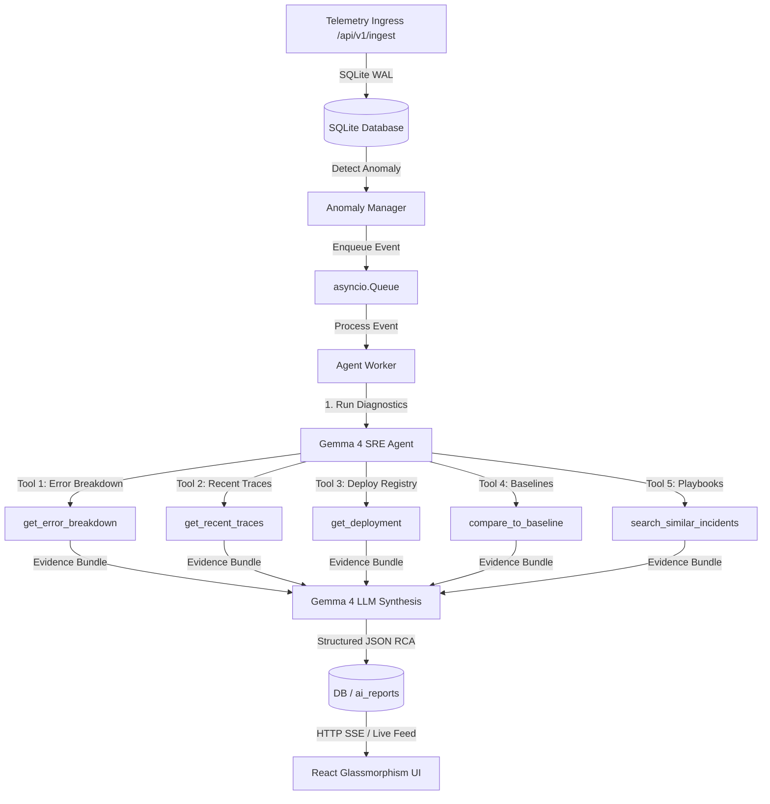

# 🔮 TraceAI: Gemma 4-Powered Incident SRE Agent

🎬 **Live Demo**  
[](https://www.youtube.com/watch?v=im9wt5jDCkE)

---

[](https://ai.google.dev/gemma)
[](https://aistudio.google.com/)
[](LICENSE)
[](https://gemma.devpost.com/)

**TraceAI** is a high-performance, autonomous **SRE (Site Reliability Engineering) Agent** powered by Google's next-generation **Gemma 4** model. It is specifically designed for high-stakes, low-resource organizations—such as rural health networks, clinics, and critical NGOs—that run vital digital systems but lack the resources to maintain 24/7 on-call SRE teams.

When critical systems start failing or payment APIs degrade at 2:00 AM, TraceAI autonomously ingests telemetry, executes diagnostic tools, performs automated comparison baselines, and generates actionable, fully auditable Root Cause Analysis (RCA) and playbooks—all in seconds.

---

## 🌟 The Impact Story (Why TraceAI?)

> *A rural medical clinic in an underserved area runs a critical, low-margin digital registration and copay payment system. At 2:00 AM, the payment service starts dropping transactions. Latency spikes to 3.5 seconds. There is no dedicated SRE engineer to wake up. The clinic's digital systems freeze, causing delays in patient admissions.*

**TraceAI is their SRE on call.** 
1. The anomaly detector triggers on a latency surge and error spike.
2. The **TraceAI Agent** activates, spinning up a targeted incident workspace.
3. It autonomously runs 5 distinct telemetry and registry tools to collect facts.
4. **Gemma 4** correlates the tools' output, diagnosing that the recent `v2.4.1-hotfix` deploy contains a connection pool leak, and instantly outputs a exact shell rollback command.
5. In less than 5 seconds, the issue is understood, diagnosed, and remediated—preventing patient admission delays and saving the NGO clinic thousands of dollars in lost operational hours.

---

## ⚙️ Core Architecture & Pipeline

TraceAI is built with a decoupled, event-driven async architecture featuring a SQLite WAL high-throughput telemetry base, background worker queues, and an agentic tool-use layer that feeds directly into Gemma 4.



### 🧰 SRE Agent Tool belt

To prevent hallucinations, the SRE Agent does not inspect code or logs blindly. It queries an advanced, telemetry-focused tool belt:

1. `get_error_breakdown`: Analyzes absolute error counts, error rates, and identifies top-failing operations in the last `N` minutes.
2. `get_recent_traces`: Pulls distributed trace ids, durations, and detailed status arrays from the active production databases.
3. `get_deployment`: Inspects the active registry to find the exact timestamp, version, and environment tag of the latest deployment.
4. `compare_to_baseline`: Compares the active anomaly against standard baseline telemetry for error rates (multipliers) and average latencies.
5. `search_similar_incidents`: Uses contextual symptom matching to find relevant playbooks and previous remediation paths.

---

## 🚀 Quick Start Guide

### Prerequisites
- **Python** 3.10+
- **Node.js** 18+ & **npm**

---

### 1. Clone & Set Up Backend

```bash
# Clone the repository
git clone https://github.com/kanklc34/traceai
cd Trace-AI

# Create and activate virtual environment
# Windows:
python -m venv venv
venv\Scripts\activate

# macOS / Linux:
# python3 -m venv venv
# source venv/bin/activate

# Install dependencies
pip install -r requirements.txt

# Copy environment template
copy .env.example .env  # Windows
# cp .env.example .env   # macOS/Linux
```

Configure your `.env` file with your Google AI Studio API key:
```env
GEMMA_API_KEY=your_google_ai_studio_api_key_here
TRACEAI_DEV_MOCK=0
```

> **Note:** If you want to run the system without an active API key or offline, set `TRACEAI_DEV_MOCK=1`. The SRE engine will automatically switch to **Evidence-Only Mode**, running all diagnostic tools, performing data synthesis, and presenting rich, local calculations in the UI!

Now, run the FastAPI backend server:
```bash
cd backend
python main.py
```
*The backend will run on `http://localhost:8000` and automatically create the WAL database at `backend/data/traceai_demo.db`.*

---

### 2. Set Up Frontend (Vite + React)

Open a new terminal window:
```bash
cd frontend-v2
npm install
npm run dev
```
*The React frontend will spin up at `http://localhost:3000` (or `http://localhost:5173`). Open this URL in your browser.*

---

### 3. Simulate an Incident

You can trigger a live payment service breakdown scenario using either the **"Trigger Incident"** button directly on the dashboard header, or by running the script from the root of the project:

```bash
# Return to the root folder and run:
python trigger_demo_spike.py
```
## 🖥️ Offline Mode (Local Gemma 4 via Ollama)

TraceAI supports fully offline inference using Gemma 4 locally:

```bash
ollama pull gemma4
```

Then set in `.env`:
```env
TRACEAI_USE_OLLAMA=1
OLLAMA_MODEL=gemma4
```
#### What happens next:
1. The injector simulates three distinct phases: **Latency degradation** (800ms+), **Instability** (flapping error status), and **Critical failure** (spikes of 3000ms+ and error rates).
2. Within **~5 seconds**, the backend anomaly manager flags the incident and queues it.
3. The Gemma Agent runs its **5 telemetry tools** sequentially, collecting a comprehensive evidence bundle.
4. **Gemma 4** evaluates the bundle, synthesizes the root cause, calculates impact levels, and outputs a recommended remediation plan.
5. The React UI displays the live step-by-step SRE tool feed and the final RCA board dynamically!

---

## 💻 Tech Stack & Stack Breakdown

*   **Model Core**: Google `gemma-4-26b-a4b-it` (primary model) and `gemma-4-31b-it` (fallback model).
*   **Backend framework**: `FastAPI` (Asynchronous endpoints, lightweight routing).
*   **Database & ORM**: `SQLite` (optimized with Write-Ahead Logging for high telemetry ingestion) & `SQLAlchemy + aiosqlite` (fully async operations).
*   **Agent Core**: Async Python workers using dynamic system tools, JSON parsing fallbacks, and deterministic evidence engines.
*   **Frontend UI**: `React (TypeScript)` + `Vite` + `Tailwind CSS`.
*   **Visual Assets & Icons**: `Lucide React` & premium dark-glassmorphism HSL custom palettes.

---

## 📊 API Reference

### Ingest Telemetry Trace
*   **Endpoint**: `POST /api/v1/ingest`
*   **Payload**:
    ```json
    {
      "trace_id": "demo-ab12d",
      "service": "payment-service",
      "timestamp": "2026-05-17T11:45:00Z",
      "spans": [{
        "span_id": "sp-29ca",
        "operation": "checkout_flow",
        "status": "error",
        "latency_ms": 3200.0,
        "metadata": {"env": "production", "version": "v2.4.1-hotfix"}
      }]
    }
    ```

### Get Latest Incident Status
*   **Endpoint**: `GET /api/v1/incidents/latest`
*   **Returns**: The active incident details, tool execution stages, and Gemma 4 generated root cause analysis.

### Get Agent Tool Logs
*   **Endpoint**: `GET /api/v1/agent-steps`
*   **Returns**: The chronological steps taken by the Gemma agent during the diagnostic run.

---

## 🛡️ License

Distributed under the MIT License. See `LICENSE` for more information.

---

Developed with 💜 for the **Gemma 4 Good Hackathon**. Let's build robust, intelligent, and affordable digital infrastructure for every clinic, community, and team around the globe.
